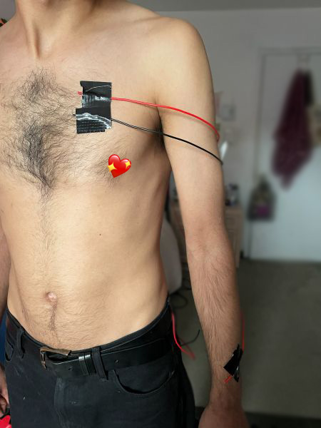
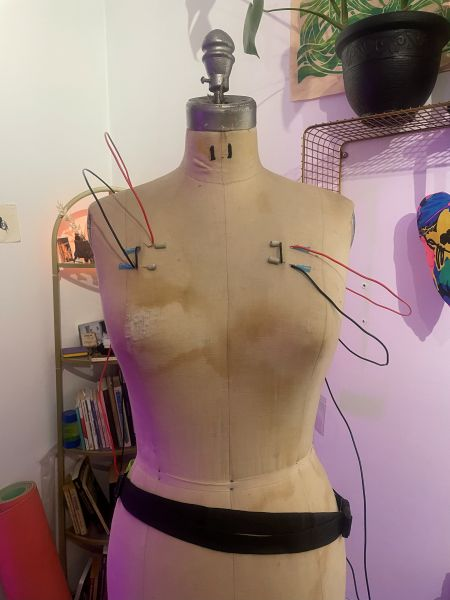
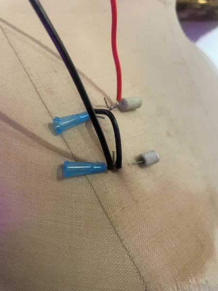

<h2>November 14th - Prototyping</h2>

  

prototype for wearable! with tape! because we didn't have time to do the whole rigamarole for needles today but i wanted to start measuring wirelengths to see what we're working with here. focusing on 3 interactions to start: tilt sensor, photoresistor (currently programmed just to respond when light is blocked/dimmed, but since it's an analog sensor has potential for more responses), and touch/complete circuit connection (putting forearms together). it's wild to me that this amount of wires is potentially only 3 interactions. it looks so simple but i've worked so hard to get this far T_T potentially want to add more tilt sensors on the arms, but focusing on these three first. 

so many sensors I originally thought could be incorporated won't work - thermistor (see commit messages for my sadness), capacative sensor, motion sensor, gyroscope sensor... I think there were more but maybe not? Stupid thermistor is not going to be involved, even though it worked with breath, which was interesting... but the resistor itself takes FOREVER to reset back to room temperature, which makes it very difficult to incorporate, since you can trigger it once and then it's just kind of... useless, and weird and flickery in its response. it's possible someone with more experience than me could get it working better, but i'm already over my head w the physics equations it takes to get this thing to give me results in kelvin/celsius, much less trying to make it work reliably with input.

movements will be: tilting torso, changing light (either with hand, or by tilting body down away from lights), and connecting needles on forearms to complete a circuit. unsure what games can be played with three controls, two of which are on/off only.... trying to think of simple/binary interactions, like "open", but that's getting ahead of ourselves.

tilt sensor and photoresistor are going to go on chest, soldered in a short piece of wire that'll be like a ladder between two needles that we tested the other day. so they'll be close to the body, and not adding weight to the aesthetic components. 

I'm obsessed w how the wires look moving around from attatchment in the back to the forearms, it's so cool??? it looks kinda simple and small in the pictures, but the movement of those wires feel the most deeply cyborg/computer bondagey.

i'm buying a runner's belt bag thingy and going to tuck the pi and power source in that, wrapped around the middle of the torso.... still not entirely sold on that idea, since i like the idea of making R hold the pi, and watch for it's positive response in terms of lights... but the lights were actually just for me prototyping, not necessarily part of the project. it'd be cool to incorporate some LEDS in the wearable though, maybe on the arms or something. and with it's current design it makes sense for the wires to "end" in the back.

possibly not going to need to attach any circuits to needles in the back, but will put in needles to pin the wires in place aesthetically. (8 needles total, i think? that's actually a very small number...) 

testing this with needles i'm sure is going to be a bucket of a thousand problems. trying to schedule w R for a day when we don't have to run to something afterwards. 

<h3>things to think about:</h3>
another thing i'm sort of too overwhelemed to think about is the "hooking" mechanism on the needle itself. it's possible i'll need to put in another needle going perpendicular to the circuit needle in order to hold the wire in place on the needle. cuz currently bending a hook in the wire and just looping that around doesn't feel reliable enough, especially not with this much movement. a friend suggested looking on fetlife for examples.

 controller dynamics - R wants to be the controller and do the controlling. Thinking about inviting V and C over because that could be a different dynamic - where V wants to be the controller and C could do the controlling... at this point /I/ want nothing to do with the using of this device. Setting it up is more than enough play/work. 

<h2>November 6th - Ladders</h2>

Today, trying to test the limits of human skin as a resistor! built this needle circuit ladder - the LED glows a bit dimmer but it does appear that skin is not a very strong resistor at all, so that’s cool. Don’t need to worry about circuits in series being too depleted. 

HOWEVER… issues of making sure everything stayed together did begin to arise when the leapfrogging length of the circuit increases. Every connection becomes a point where the circuit can break, and it does break fairly easily since wires can just slip off.

So… need to come up with some better hooking mechanism (it can’t just be a tight spiral, which i originally had, bc things need to go on the needle between the cap and skin), I need to improve my skills so that i could insert a needle with a wire already attached (possible, actually? I should try? but that only solves half the problem), aaaaand ideally we need some kind of cap for the open end of the needle to keep the wires from sliding off. I was right in that skin has enough pull that the needles themselves don’t slip out like how they were doing on the mannequin, but wires are still falling off the ends which is not ideal. 

Another thing we tested: built two halves a circuit each connected to a needle in each arm, and made R twist around to make the needles touch to complete the circuit and light up an LED. This was actually really cool and fun to watch, def a movement I want to incorporate into the final design. I didn’t document it which is annoying, but I'm sort of overwhelmed with keeping things sanitary while building this, and picking up a nasty phone mid scene feels daunting.. 

R likes the asymmetry look of the model though. he keeps pushing me to add more things and i’m like look the issue is clearly not the painful needles in your body the limit is my capacity to manage the circuit lmao (am i topping the needle body AND the computer??) 

<h3>Possible solutions:</h3> conductive thread? easy to wind around the needle for the ladder thing, though the ladder thing is purely aesthetic. But a good aesthetic.

<h3>next steps:</h3>
- testing other sensors, like reed switch, thermistor, and photoresistor
 - getting better at piercing w my left hand, some body positions are awkward!
 - figuring out caps….
 - find longer needles?

<h3>some weird things that came up:</h3> 
- one of the needles i put in maybe wasnt deep enough, which made it more slidey?
 - R moved around in such a way that a needle went back inside him and then went much deeper than intended - another thing that cap would potentially prevent. (he is fine, everything is fine! just slightly more blood than usual!)

 i’m really so appreciative of my sweet smart friend for letting me hurt him so much it’s soooooo nice !

<h2>November 5th 2025 - Fashion </h2>
after weeks of trying to figure out how to get a dress form, a halloween miracle occured and one just SHOWED UP AT MY HOUSE. shoutout to T for bringing it as a decoration and letting me keep it for a while.

 working on the fashion-y non tech part… def leaning into sci fi aesthetic (which i was doing unconsciously, and R pointed out consciously). surprisingly difficult to get wires to look like what i want with only a loop around a needle as a support? this took TWO HOURS - mostly focused on the one floating above the shoulder. wondering how different the wires will sit in skin? needles def sliding out of this cloth very very easily, i added bits of eraser on the end, i don’t think that will be nearly as much of an issue, if it’s an issue at all, in skin. also want to add one on arms but mannequin has no arms. like maybe one directly going from back to forearm. sort of angelic cyborg bondage.

 

a nice accident: i think it’ll look good attached to pi in the front or back so that’s nice that that’ll be flexible. 

tilt sensor is great but very much wondering what other sensors are out there, i simply don’t know? they have to be simple on/off switches since managing more than two in/out wires on a needle is logistically awful. 

skill issues: i’m not super great at getting needles in skin with the accuracy i want, which has negative effects on how much exposed needle there is to connect to. i…. think i actually have a list of people willing to sit there while i practice tho, god bless the freaks. 

oh, and still sort of figuring out the best way to bend the wire so it hooks properly onto the needle? it doesn’t seem to be too much of an issue since pressure of needle in skin seems to hold it in place/in contact w circuitry. it’s certainly not RELIABLE. but that’s bodies baby

design issues: this currently has zero play element in it whatsoever. even if we add the tilt sensors in the circuit as it is now (which would be easy) it's not that.. interesting. what does controller have to DO in order to play? tilt, yes - or something like keep one on and on tilted - but wonder if forearm ones can be touched to complete a circuit. R will help me puzzle some of this out tomorrow. 

shoutout to the gender advocacy center for having no questions asked free needles and sharps containers for distribution.

<h2>October 23rd 2025 - IT WORKS??</h2>
A friend* came over and let me put needles in their arm this morning. It was the first time I've ever done it and I was really scared (more scared than they were, since they've done this plenty of times before) and I kinda messed it up and made it hurt more than it needed to but I did it!!! (sorry friend.) 

 Friend was extremely patient and had many good ideas. We talked for a while about sanitation - obviously having needles touching wires that have been all over the place is NOT sanitary, and I'm not trying to give them an infection. My idea was that wires would only be connected to the part of the needle that doesn't go through the end (the part with the cap) so the needle part that passes through the body doesn't "touch" the wires, but the wires are still kind of bumping up against the insesrtion point, so we opted for... a less sanitary approach, which some kink people would definitely chew me out about. Wiping the wires down with alcohol before touching them to the needle (maybe should get a spray bottle for this?) and then wiping/spinning the needle with a swab with alcohol on it before withdrawing it from the skin was the solution. 

My original theory was that the circuit would only work if needles were on the same side of the wire, which did indeed work!!!! But at one point friend suggested I attatch it to the other side of the wire - which ALSO WORKED! So current is being conducted THROUGH human skin (which I thought would be too resistant) and 3.3V is not enough to burn or cause discomfort. Certainly wires connected on each end is the hottest/prettiest way for it to look... and also more bondage-y looking. Literally wired into the computer. Very cyborg, very cool. Some good Testuo the Iron Man inspo happening here. 

 

As suspected, capacitive sensor... didn't work. Or rather it did, but extremely weirdly? I was expecting it to fully not recieve any information and for the LED to remain either off or on entirely without changing... But instead it sort of flickered on and off unpredictably? We tried testing it with movement, with outside touch, staying still, etc, and there wasn't any sort of real predictive pattern to the thing... Which is very odd. But I learned this with my past plant synth project - working with bioelectric systems is actually wildly unpredictable because biological things do not function like computers at all! So... maybe this stays as a chaos element? 

Tilt sensor worked perfectly! I was wondering if needle being jostled in the skin would be too painful but either friend is an insane masochist (possible) or skin is an insane organ (seems likely) - he was showing me how you could turn the whole needle basically 90 degrees before it even started to become uncomfortable. So the little movements from the wire attatched to the needle weren't particularly noticable for him.

Something fun though - HE wanted to do more of the controlling of the sensors? I had the wires intentionally long so I would be able to connect without causing harm and explore - but he wanted to move his arm around and cause the sensor to activate. 

Which brought up some fun ideas for future collaboration, since friend is down to keep working with me on this!! I was originally evisioning something that I move around/manipulate/twist/cause pain for someone else, and they immediately jumped to wanting to move around or figuring out how to navigate in ways such that would avoid triggering sensors (like a typical sort of predicament scenario)... 

So:
Does this become a game with win/lose states? Not super thrilled about that... 
Want it to be collaborative between top and bottom!! We both want to play with the circuit and have agency over it :) (Maybe that's something I need to give up though? Should I be adding things to the circuit during play or is it a set it up and let it go situation?) 
Friend's suggestion - multiple triggers need to be activated at the samae time in order to achieve "success" (LED going on? or perhaps off?) "What if one edge of the connection is weaker/not activated, and you have to move in order to make the connection?"
Is the circuit something to "solve"? Idk if I like that either... 

<h3>Future concerns: </h3>
What am I actually doing this for/what am I trying to say? I kinda didn't expect this to actually work, now what?? 
If new components need more power, will voltage be too uncomfortable to withstand??
How to connect raspberry pi and power source to human body so rest of circuit halo is wearable?
Rethink wired connection. Currently using a very thick hard to manipulate wire, is that the best option? I want something sturdy to support different sensors/components... 

 *They want to remain annoymous and will be referred to only as friend :) 

<h2>October 20th 2025 - Progression and Failure</h2>
Okay, spent a bit programming and testing a tilt switch. Pretty simple, pull down schematic, when sensor is flat nothing happens, when it is moved (kinda far - at least 90 degrees it seems) it prints to the console and a LED lights up. 

Thinking this will be more effective than a capacitive sensor.. Since by default the touch sensor will be touching skin (it'll be inside skin!) something that requiries more in terms of movement might be more effective/actually work.

My concerns are that the level of tilt required would be way too painful?? I'm going to have the sensor out on some wires, so it's not like the needle in someone's skin needs to be bent, but I'm unsure what that pressure will feel like for the controller person.

Thought maybe let's try something more senstiive, so started building out something with the MPU6050 sensor, that has a gyroscope that senses position and acceleration... which would be cool to try and get more articulate information, and maybe have the LED set to light up with a lesser tilt, but... I can't hook this big ass chip to someone's skin??? At least I don't think so. And it's the whole chip that needs to be tilted. It'd look ugly - just a random circuitboard and 4 gangly wires going back to the Pico W... Cool to work/learn with a new sensor though. This would def work better embedded in something, so maybe we're going back to a clothing wearable....?

I've been testing the needles sans-skin by sticking them in my pants and wiring up from there. I forgot I had one in there and stabbed myself a little bit, which... I dunno, good be interesting to incorporate that sort of bodily awareness/intentionality on purpose. Especially since then it wouldn't depend on getting someone over to stab with needles, which isn't like super inconvenient, but not something I can do entirely independently. 

<h2>October 16th 2025 - Initialization</h2>

Had to reference my own past work for the easiest way to get the MPR 121 sensor set up again properly, so that was nice. Haha. Also decided to work with Thonny rather than PyCharm, I have no idea why an old prof insisted on PyCharm, but it's so bulky and unnecessary for what I'm doing, Thonny has a built in very very simple terminal system and is so helpful. (Bidirectional framing coming in strong here.) 

Surprised/intrigued that needle still works when going through cloth. I mean I guess it's not that surprising, since cloth isn't a particularly strong resistor, but the fact that it can penetrate something and still work on either side is cool. Currently using cheap sewing needles rather than piercing needles but presumably the effect will be the same, but we're still in deep prototype mode. 

 

I need to find someone else to either put a needle in me or let me put a needle in them to test the circuit, which feels tricky right now. I might be able to do this myself but that feels a bit precarious and like I'm doing too much - I don't want to be moving around a lot fixing circuitry if I'm also part of the circuit, that seems way too easy for something to fall apart. 

Also what do I want this to LOOK like on a human body? I want it to be a beautiful adornment, halo like wires... Where is the wiring for the LED(s) gonna go, since it's not exactly directly connected to the needle other than through the Pico W. 

So next steps: thoughts on visuals. Also other sensors other than touch - want to do a tilt sensor or something, so it alerts when it's jostled... Again causing discomfort if it's in someone's skin. 

<h2>October 2nd 2025 12:49 AM - Idea Generation</h2>
ALRIGHT. IM BORED OF SCREENS. WHATS THE SCREEN GONNA DO FOR ME ANYMORE??? 

i want to try this thing that might be a terrible , dangerous and entirely ineffective idea 

ive been tossing it around in my head but want to jot it down:

doing some sort of bdsm needle play that ends up being an electronic interactive adornment. would be amazing to have some capacitive touch wires attached to needles in someone’s skin, and touch making an led light up / move around to different LEDs on other parts of the body. 

the person who becomes(???) the “controller” experiences painful/pleasurable sensation when played with… something something embodiment but make it really really literal 

many issues: human skin is resistant first of all, so all wiring would have to be on the part of needle before it enters skin barrier. this is better for sanitary reasons tho. risk of accidental short circuit and causing unintentional burns… low voltage required to power an LED probably not enough to burn? (not trying to cause harm, just pain!) 

this feels highly inappropriate in an academic context? is it even appropriate in a kink context? seems minimally qualified for safe/sane/consenual? 

goals for the weekend are bust out some needles and see if i can get a circuit working sans human body
crafting bdsm scenes is basically game design (u got a magic circle, particular win conditions, pre determined rules, fantastical scenarios….)
